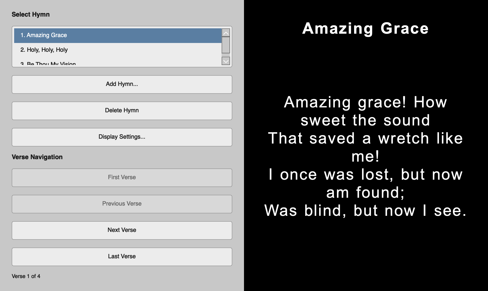

# Hymn Director

Hymn Director is a desktop app for displaying hymn verses during congregational singing. The left side of the window holds controls; the right side shows the current hymn title and verse text on a black background suitable for projection.



## Requirements

- Python 3.12 or newer
- [uv](https://docs.astral.sh/uv/) for dependency management

## Installation

Clone or download this project, then install dependencies:

```bash
cd hymn-director
uv sync
```

This creates a virtual environment in `.venv` and installs PyQt6.

## Running the app

```bash
uv run hymn-director
```

The window opens at a 2:1 width-to-height ratio by default. You can resize it as needed.

## Main window

The app is split into two halves:

- **Left panel** — hymn list, management buttons, verse navigation, and display settings
- **Right panel** — hymn title and verse text on a black background

### Select a hymn

The hymn list shows every hymn in the database, sorted by hymn number. Click a hymn to display it. The app starts on the first hymn in the list.

### Navigate verses

Use the verse buttons below the hymn list:

- **First Verse** — jump to verse 1
- **Previous Verse** — go back one verse
- **Next Verse** — advance one verse
- **Last Verse** — jump to the final verse

Buttons are disabled when that action is not available (for example, **Previous Verse** on verse 1).

## Add a hymn

1. Click **Add Hymn...**
2. Enter the hymn **title** and **number**
3. Enter one or more verses in the text fields
4. Use **Add Verse** or **Remove Last Verse** to adjust how many verses the hymn has
5. Click **Save Hymn**

Each hymn number must be unique. If you try to save a number that is already in use, the app shows an error.

The hymn list updates automatically and selects the hymn you just added.

## Delete a hymn

1. Select the hymn in the list
2. Click **Delete Hymn**
3. Confirm the deletion

This permanently removes the hymn and all of its verses from the database.

## Display settings

Click **Display Settings...** to change how text appears on the right panel:

| Setting | Description |
|---------|-------------|
| **Font** | Any font installed on your system |
| **Font size** | Text size in points |
| **Line spacing** | Space between lines, as a percentage of normal |
| **Letter spacing** | Extra space between characters, in pixels |
| **Word spacing** | Extra space between words, in pixels |

Click **Save** to apply changes. Settings are stored in `data/display_settings.json` during development and in your user data directory when running a built app.

## Building the app

Hymn Director uses [PyInstaller](https://pyinstaller.org/) to build standalone executables for macOS, Windows, and Linux.

### Local build

Install development dependencies, then run the build script for your platform:

```bash
uv sync --dev
```

**macOS / Linux:**

```bash
./scripts/build.sh
```

**Windows (PowerShell):**

```powershell
.\scripts\build.ps1
```

Or run the steps manually:

```bash
uv run init-db
uv run pyinstaller --noconfirm hymn-director.spec
```

Build output appears in `dist/`:

| Platform | Output | Icon format |
|----------|--------|-------------|
| macOS | `dist/HymnDirector.app` | `.icns` |
| Windows | `dist/HymnDirector/HymnDirector.exe` | `.ico` |
| Linux | `dist/HymnDirector/HymnDirector` | window icon via `.png` |

Icon source files live in `assets/icons/`. To regenerate platform icons from the master PNG:

```bash
uv run python scripts/generate_icons.py
```

Note: `.icns` generation requires macOS (`iconutil`). The repository includes pre-generated icon files so builds work on all platforms.

### Bundled data

The build bundles a seed `hymns.db`. On first launch of a built app, that database is copied to the platform-specific user data directory:

- **macOS:** `~/Library/Application Support/hymn-director/`
- **Windows:** `%LOCALAPPDATA%\hymn-director\hymn-director\`
- **Linux:** `~/.local/share/hymn-director/`

Display settings and any hymns you add or edit are saved there, not inside the application bundle.

## Data files (development)

| File | Purpose |
|------|---------|
| `data/hymns.db` | SQLite database of hymns and verses |
| `data/display_settings.json` | Display font and spacing preferences |
| `lds_hymns.json` | LDS hymn book lyrics (generated from `ldshymnlyrics/`) |
| `childrens_songbook.json` | Children's songbook lyrics (generated from `ldshymnlyrics/childrenssongbook/`) |

On first run, the database is created automatically with sample hymns if it does not exist yet.

To recreate or seed the database manually:

```bash
uv run init-db
```

### Convert hymn lyrics to JSON

Lyrics in `ldshymnlyrics/` are plain text files with verses separated by `###`. To combine them into JSON files in the project root:

```bash
uv run python scripts/convert_lyrics_to_json.py
```

This writes:

- `lds_hymns.json` — all `.txt` files in `ldshymnlyrics/` (433 hymns)
- `childrens_songbook.json` — all `.txt` files in `ldshymnlyrics/childrenssongbook/` (255 songs)

Each entry has a `number`, `title`, and `verses` array. Re-run the script after updating the source text files.

## Project layout

```
hymn-director/
├── data/                  # Database and settings (development)
├── docs/                  # Documentation assets
├── ldshymnlyrics/         # Source hymn lyrics (plain text)
├── scripts/               # Build and conversion scripts
├── src/hymn_director/     # Application source code
├── hymn-director.spec     # PyInstaller build configuration
├── lds_hymns.json         # Generated LDS hymn book lyrics
├── childrens_songbook.json # Generated children's songbook lyrics
├── pyproject.toml
└── uv.lock
```
